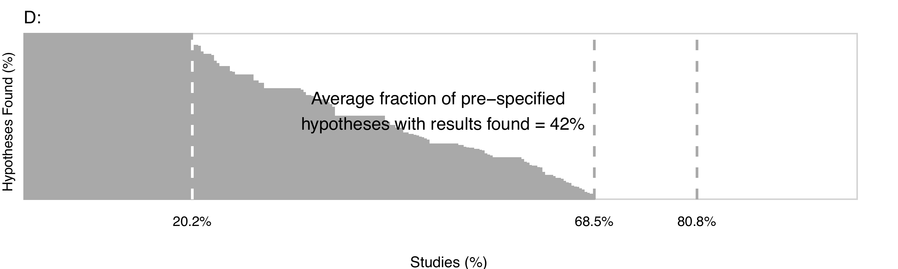
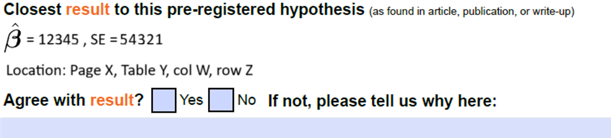
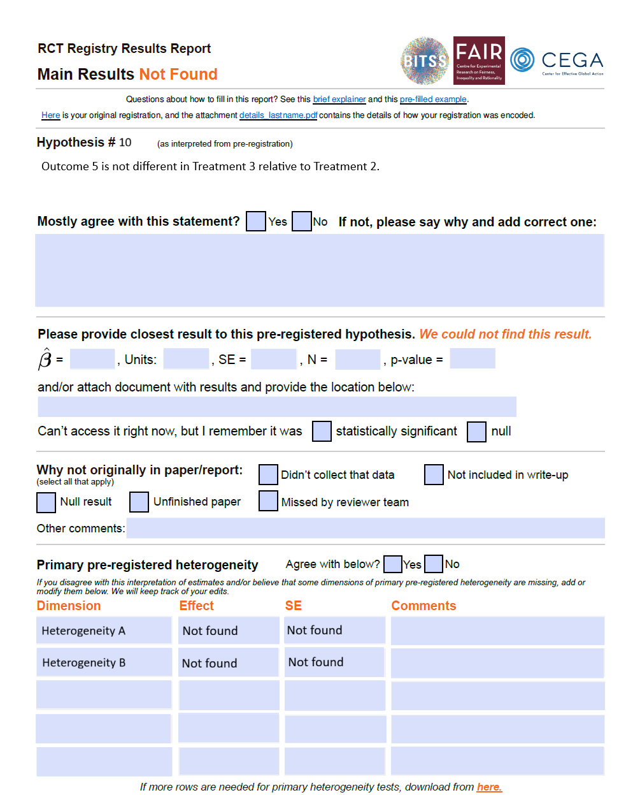

```{r setup, include=FALSE}
options(htmltools.dir.version = FALSE)
knitr::opts_chunk$set(echo = FALSE, out.width = "85%", fig.align = "center")

fig_dir <- "../../../data/07_output/03_figures"
png_dir <- "figs"
dir.create(png_dir, showWarnings = FALSE)

# Convert the PDFs used in this deck to PNGs once
needed <- c(
  "waterfall_all_hyp.pdf",
  "fig_null_cond_hist_all_v2_without_priors.pdf",
  "combined_hist_priors.pdf",
  "panels_by_group.pdf",
  "y1_study_tretment_effect_dd.pdf",
  "combined_waterfall.pdf",
  "filedrawer_post_base.pdf"
)

for (f in needed) {
  src <- file.path(fig_dir, f)
  out <- file.path(png_dir, sub("\\.pdf$", ".png", f))
  if (file.exists(src) && (!file.exists(out) || file.mtime(src) > file.mtime(out))) {
    pdftools::pdf_render_page(src, page = 1, dpi = 220) |>
      png::writePNG(out)
  }
}

png_path <- function(pdf) file.path(png_dir, sub("\\.pdf$", ".png", pdf))
```

class: center, middle

# Beyond Publication Bias:
## Characterizing and Understanding Missing Results in Economics

<span style="font-size: 80%; text-decoration: underline;">Fernando Hoces de la Guardia</span><span style="font-size: 80%;">, Edward Miguel, Akash Shaji,<br/>
Viviane H. Silva da Rocha, Gufran Pathan, Erik Ø. Sørensen, Bertil Tungodden</span>

<br/>

.small[SEIC Kick-off Meeting — 2026]

---
class: contrib

## Contributions

We develop an approach to **standardize and record hypotheses** from the AEA Registry, and run an RCT on study authors to answer:

--

**Q1. What fraction of pre-registered hypotheses have available results after 8–9 years per study?**
  - Conditional on available, what fraction are null?

--

**Q2. What prevents researchers from reporting missing pre-registered results?**
  - Lack of *awareness*?
  - Lack of *engagement*?
  - Lack of *resources*?

<div style="margin-top: -15px; visibility: hidden; font-size: 24px;">.hi-num[Our stronger intervention helps explain between a quarter and a third of the File Drawer (28%).]</div>

---

class: center, middle, samp-slide
background-image: url("figs/consort_all.png")
background-size: contain
background-position: center
background-repeat: no-repeat

<div class="samp-cover-bc"></div>

---
count: false
class: center, middle, samp-slide
background-image: url("figs/consort_all.png")
background-size: contain
background-position: center
background-repeat: no-repeat

<div class="samp-cover-c"></div>

---
count: false
class: center, middle, samp-slide
background-image: url("figs/consort_all.png")
background-size: contain
background-position: center
background-repeat: no-repeat

---
count: false
class: center, middle, samp-slide
background-image: url("figs/consort_all.png")
background-size: contain
background-position: center
background-repeat: no-repeat

<div style="position: absolute; bottom: 60px; right: 40px; text-align: right; font-size: 29px; color: #c0392b; font-weight: bold;">
Stage 1: Humans only (intentionally no LLM)<br/>
Stage 2: Explore use of LLM (ongoing, not in this paper)
</div>

---

## Main Outcomes

.three-col[
.col[
.col-title[Fraction *Available*]
<table class="otbl"><tr><th></th><th></th><th>Available</th></tr><tr><td class="hyp">H1</td><td class="zig">/\/\/\/</td><td class="yes-g">Yes</td></tr><tr><td class="hyp">H2</td><td class="zig">/\/\/\/</td><td class="yes-g">Yes</td></tr><tr><td class="hyp">H3</td><td class="zig">/\/\/\/</td><td class="no-w">No</td></tr><tr><td class="hyp">H4</td><td class="zig">/\/\/\/</td><td class="no-w">No</td></tr></table>
]
.col[
.phantom[.col-title[Fraction *Null*]
<table class="otbl"><tr><th></th><th></th><th>Available</th><th>Null</th></tr><tr><td class="hyp">H1</td><td class="zig">/\/\/\/</td><td class="yes-g">Yes</td><td class="no-w">No</td></tr><tr><td class="hyp">H2</td><td class="zig">/\/\/\/</td><td class="yes-g">Yes</td><td class="yes-dg">Yes</td></tr><tr><td class="hyp">H3</td><td class="zig">/\/\/\/</td><td class="no-w">No</td><td class="empty"></td></tr><tr><td class="hyp">H4</td><td class="zig">/\/\/\/</td><td class="no-w">No</td><td class="empty"></td></tr></table>]
]
.col[
.phantom[.col-title[Fraction *Explained*]
<table class="otbl"><tr><th></th><th></th><th>Avail.</th><th>Null</th><th>Explained</th></tr><tr><td class="hyp">H1</td><td class="zig">/\/\/\/</td><td class="no-w">Yes</td><td class="no-w">No</td><td class="empty"></td></tr><tr><td class="hyp">H2</td><td class="zig">/\/\/\/</td><td class="no-w">Yes</td><td class="no-w">Yes</td><td class="empty"></td></tr><tr><td class="hyp">H3</td><td class="zig">/\/\/\/</td><td class="no-w">No</td><td class="empty"></td><td class="no-w">No</td></tr><tr><td class="hyp">H4</td><td class="zig">/\/\/\/</td><td class="yes-b">No</td><td class="yes-b"></td><td class="yes-b">Yes</td></tr></table>]
]
]

---
count: false

## Main Outcomes

.three-col[
.col[
.col-title[Fraction *Available*]
<table class="otbl"><tr><th></th><th></th><th>Available</th></tr><tr><td class="hyp">H1</td><td class="zig">/\/\/\/</td><td class="yes-g">Yes</td></tr><tr><td class="hyp">H2</td><td class="zig">/\/\/\/</td><td class="yes-g">Yes</td></tr><tr><td class="hyp">H3</td><td class="zig">/\/\/\/</td><td class="no-w">No</td></tr><tr><td class="hyp">H4</td><td class="zig">/\/\/\/</td><td class="no-w">No</td></tr></table>
]
.col[
.col-title[Fraction *Null*]
<table class="otbl"><tr><th></th><th></th><th>Available</th><th>Null</th></tr><tr><td class="hyp">H1</td><td class="zig">/\/\/\/</td><td class="yes-g">Yes</td><td class="no-w">No</td></tr><tr><td class="hyp">H2</td><td class="zig">/\/\/\/</td><td class="yes-g">Yes</td><td class="yes-dg">Yes</td></tr><tr><td class="hyp">H3</td><td class="zig">/\/\/\/</td><td class="no-w">No</td><td class="empty"></td></tr><tr><td class="hyp">H4</td><td class="zig">/\/\/\/</td><td class="no-w">No</td><td class="empty"></td></tr></table>
.small[Denominator varies between descriptive (conditional) and causal analysis (unconditional).]
]
.col[
.phantom[.col-title[Fraction *Explained*]
<table class="otbl"><tr><th></th><th></th><th>Avail.</th><th>Null</th><th>Explained</th></tr><tr><td class="hyp">H1</td><td class="zig">/\/\/\/</td><td class="no-w">Yes</td><td class="no-w">No</td><td class="empty"></td></tr><tr><td class="hyp">H2</td><td class="zig">/\/\/\/</td><td class="no-w">Yes</td><td class="no-w">Yes</td><td class="empty"></td></tr><tr><td class="hyp">H3</td><td class="zig">/\/\/\/</td><td class="no-w">No</td><td class="empty"></td><td class="no-w">No</td></tr><tr><td class="hyp">H4</td><td class="zig">/\/\/\/</td><td class="yes-b">No</td><td class="yes-b"></td><td class="yes-b">Yes</td></tr></table>]
]
]

---
count: false
name: outcomes

## Main Outcomes

.three-col[
.col[
.col-title[Fraction *Available*]
<table class="otbl"><tr><th></th><th></th><th>Available</th></tr><tr><td class="hyp">H1</td><td class="zig">/\/\/\/</td><td class="yes-g">Yes</td></tr><tr><td class="hyp">H2</td><td class="zig">/\/\/\/</td><td class="yes-g">Yes</td></tr><tr><td class="hyp">H3</td><td class="zig">/\/\/\/</td><td class="no-w">No</td></tr><tr><td class="hyp">H4</td><td class="zig">/\/\/\/</td><td class="no-w">No</td></tr></table>
]
.col[
.col-title[Fraction *Null*]
<table class="otbl"><tr><th></th><th></th><th>Available</th><th>Null</th></tr><tr><td class="hyp">H1</td><td class="zig">/\/\/\/</td><td class="yes-g">Yes</td><td class="no-w">No</td></tr><tr><td class="hyp">H2</td><td class="zig">/\/\/\/</td><td class="yes-g">Yes</td><td class="yes-dg">Yes</td></tr><tr><td class="hyp">H3</td><td class="zig">/\/\/\/</td><td class="no-w">No</td><td class="empty"></td></tr><tr><td class="hyp">H4</td><td class="zig">/\/\/\/</td><td class="no-w">No</td><td class="empty"></td></tr></table>
.small[Denominator varies between descriptive (conditional) and causal analysis (unconditional).]
]
.col[
.col-title[Fraction *Explained*]
<table class="otbl"><tr><th></th><th></th><th>Avail.</th><th>Null</th><th>Explained</th></tr><tr><td class="hyp">H1</td><td class="zig">/\/\/\/</td><td class="no-w">Yes</td><td class="no-w">No</td><td class="empty"></td></tr><tr><td class="hyp">H2</td><td class="zig">/\/\/\/</td><td class="no-w">Yes</td><td class="no-w">Yes</td><td class="empty"></td></tr><tr><td class="hyp">H3</td><td class="zig">/\/\/\/</td><td class="no-w">No</td><td class="empty"></td><td class="no-w">No</td></tr><tr><td class="hyp">H4</td><td class="zig">/\/\/\/</td><td class="yes-b">No</td><td class="yes-b"></td><td class="yes-b">Yes</td></tr></table>
.small[Types of explanation range from logistical to analytical (more later).]
]
]

<a href="#reg-descriptives" class="badge-link">Registration descriptives</a>
<a href="#reg-descriptives-encoders" class="badge-link" style="bottom: 100px;">Registration Descriptives Across Encoders</a>

---
class: center, middle
count: false

# Main Finding #1: <br/> Characterizing The File Drawer <br/> for RCTs in Economics

---
name: main-waterfall
class: center, middle, wf-slide
background-image: url("figs/waterfall_all_hyp.png")
background-size: contain
background-position: center
background-repeat: no-repeat

<div class="wf-cover-bcd"></div>

---
count: false
class: center, middle, wf-slide
background-image: url("figs/waterfall_all_hyp.png")
background-size: contain
background-position: center
background-repeat: no-repeat

<div class="wf-cover-cd"></div>

---
count: false
class: center, middle, wf-slide
background-image: url("figs/waterfall_all_hyp.png")
background-size: contain
background-position: center
background-repeat: no-repeat

<div class="wf-cover-d"></div>

---
count: false
class: center, middle, wf-slide
background-image: url("figs/waterfall_all_hyp.png")
background-size: contain
background-position: center
background-repeat: no-repeat

---
count: false

## File Drawer Size: 58%

### Most Hypotheses Are Not Reported 8–9 Years After Registration

```{r, out.width="100%", fig.align="center"}

```

---

## Among Available Hypotheses: What Fraction of Results Are Null?

---
count: false
name: null-dist

## Among Available Hypotheses: What Fraction of Results Are Null?

```{r}
knitr::include_graphics(png_path("fig_null_cond_hist_all_v2_without_priors.pdf"))
```

.small[Lots of null results reported: **64.3%**. Goes against priors that support the idea "Most Published Research is False" (Ioannidis, 2005).]

<a href="#priors-main" class="badge-link" style="right: auto; left: 20px;">Comparing Estimates to Expert Priors</a>

---
count: false
class: contrib

## Contributions

We develop an approach to **standardize and record hypotheses** from the AEA Registry, and run an RCT on study authors to answer:

**Q1. What fraction of pre-registered hypotheses have available results after 8–9 years per study?**
  - Conditional on available, what fraction are null?

**Q2. What prevents researchers from reporting missing pre-registered results?**
  - Lack of *awareness*?
  - Lack of *engagement*?
  - Lack of *resources*?

<div style="margin-top: -15px; visibility: hidden; font-size: 24px;">.hi-num[Our stronger intervention helps explain between a quarter and a third of the File Drawer (28%).]</div>

---
count: false
class: contrib

## Contributions

We develop an approach to **standardize and record hypotheses** from the AEA Registry, and run an RCT on study authors to answer:

**Q1. What fraction of pre-registered hypotheses have available results after 8–9 years per study?** .hi-num[42% → File Drawer of 58%]
  - Conditional on available, what fraction are null? .hi-num[64%]

**Q2. What prevents researchers from reporting missing pre-registered results?**
  - Lack of *awareness*?
  - Lack of *engagement*?
  - Lack of *resources*?

<div style="margin-top: -15px; visibility: hidden; font-size: 24px;">.hi-num[Our stronger intervention helps explain between a quarter and a third of the File Drawer (28%).]</div>

---
count: false
class: contrib

## Contributions

We develop an approach to **standardize and record hypotheses** from the AEA Registry, and run an RCT on study authors to answer:

.grey[**Q1. What fraction of pre-registered hypotheses have available results after 8–9 years per study?** .hi-num[42% → File Drawer of 58%]
  - Conditional on available, what fraction are null? .hi-num[64%]]

**Q2. What prevents researchers from reporting missing pre-registered results?**
  - Lack of *awareness*?
  - Lack of *engagement*?
  - Lack of *resources*?

<div style="margin-top: -15px; visibility: hidden; font-size: 24px;">.hi-num[Our stronger intervention helps explain between a quarter and a third of the File Drawer (28%).]</div>

---
count: false
class: center, middle
background-image: url("figs/consort_with_rct.png")
background-size: contain
background-position: center
background-repeat: no-repeat

---

## What Can Be Done to Encourage More Reporting

What are the main constraints preventing researchers from reporting?

--

- Lack of information about expectation from the scientific community in general? → ***"Awareness" constraint.***

--

- Lack of time or perceived low interest in one's own research, combined with limited direct engagement from the scientific community → ***"Engagement" constraint.***

--

- Lack of resources when asked to report on pre-registered hypotheses in a standardized fashion → ***"Resource" constraint.***

--

### Interventions and arms

| Interventions / Arms | Control | Awareness | Engagement | Resources |
|---|:-:|:-:|:-:|:-:|
| Email + encouragement |   | ✓ | ✓ | ✓ |
| Empty **Results Report** |   | ✓ | ✓ | ✓ |
| Pre-filled **RR** |   |   | ✓ | ✓ |
| RA support (30h / $1,500) |   |   |   | ✓ |

---
name: rr-found-main
class: rr-slide
background-image: url("figs/rr_found.png")
background-size: 43%
background-position: right 3% center
background-repeat: no-repeat

## Sample Pre-Filled Results Report (RR)

.rr-text[
Only visible to the **Engagement** and **Resources** arms.

Each pre-registered hypothesis gets a one-row block with:

- statement *as we interpreted it* (authors confirm or correct),
- closest matching result we found (β, SE, location),
- pre-registered heterogeneity rows to verify.

If a result could not be found, the same form asks the authors to fill it in or tell us why.
]

<a href="#rr-notfound" class="badge-link" style="right: auto; left: 20px;">Results Not Found</a>

---
count: false
class: rr-slide
background-image: url("figs/rr_found.png")
background-size: 43%
background-position: right 3% center
background-repeat: no-repeat

## Sample Pre-Filled Results Report (RR)

<div class="rr-highlight rr-hl-title"></div>

---
count: false
name: rr-details-main
class: rr-slide
background-image: url("figs/rr_found.png")
background-size: 43%
background-position: right 3% center
background-repeat: no-repeat

## Sample Pre-Filled Results Report (RR)

<div class="rr-highlight rr-hl-details"></div>

<a href="#rr-details-backup" class="badge-link" style="right: auto; left: 20px;">Details</a>

---
count: false
class: rr-slide
background-image: url("figs/rr_found.png")
background-size: 43%
background-position: right 3% center
background-repeat: no-repeat

## Sample Pre-Filled Results Report (RR)

<div class="rr-highlight rr-hl-hyp"></div>

---
count: false

## RR Zoom — Hypothesis


---
count: false
class: rr-slide
background-image: url("figs/rr_found.png")
background-size: 43%
background-position: right 3% center
background-repeat: no-repeat

## Sample Pre-Filled Results Report (RR)

<div class="rr-highlight rr-hl-est"></div>

---
count: false

## RR Zoom — Closest Result



---
count: false
class: rr-slide
background-image: url("figs/rr_found.png")
background-size: 43%
background-position: right 3% center
background-repeat: no-repeat

## Sample Pre-Filled Results Report (RR)

<div class="rr-highlight rr-hl-het"></div>

---
count: false

## RR Zoom — Heterogeneity


---
name: te-main

## Main Treatment Effects on Fraction Available

```{r, out.width="78%", fig.align="center", out.extra='style="margin-top: -20px;"'}
knitr::include_graphics(png_path("y1_study_tretment_effect_dd.pdf"))
```

.small[Awareness does not affect Availability. Engagement and Resources increase Availability by ~6–7pp. Additional resources on top of Engagement have no effect → pooling Engagement and Resources arms.]

<a href="#estimation" class="badge-link" style="bottom: auto; top: 15px; right: 20px;">Estimation &<br/>Hypotheses</a>
<a href="#te-summary" class="badge-link" style="bottom: auto; top: 55px; right: 20px;">Treatment Effects<br/>Summary</a>

---
class: center, middle
count: false

# Main Finding #2: <br/> Understanding What is Behind <br/> Missing Results in Pre-Registered RCTs in Economics

---

background-image: url("figs/filedrawer_pre_all.png")
background-size: 75%
background-position: center 45%
background-repeat: no-repeat

## How Much of the File Drawer Can We Recover 8–9 Years After by Relaxing Constraints?

---
count: false
background-image: url("figs/filedrawer_pre_t1.png")
background-size: 75%
background-position: center 45%
background-repeat: no-repeat

## How Much of the File Drawer Can We Recover 8–9 Years After by Relaxing Constraints?

---
count: false
background-image: url("figs/filedrawer_post_t1.png")
background-size: 75%
background-position: center 45%
background-repeat: no-repeat

## How Much of the File Drawer Can We Recover 8–9 Years After by Relaxing Constraints?

.fd-bullets[
- *Awareness* only recovers a few explanations — 7% of the File Drawer (FD) (4pp/57pp)
]

---
count: false
background-image: url("figs/filedrawer_pre_t2t3.png")
background-size: 75%
background-position: center 45%
background-repeat: no-repeat

## How Much of the File Drawer Can We Recover 8–9 Years After by Relaxing Constraints?

.fd-bullets[
- *Awareness* only recovers a few explanations — 7% of the File Drawer (FD) (4pp/57pp)
]

---
count: false
background-image: url("figs/filedrawer_post_base.png")
background-size: 75%
background-position: center 45%
background-repeat: no-repeat

## How Much of the File Drawer Can We Recover 8–9 Years After by Relaxing Constraints?

.fd-bullets[
- *Awareness* only recovers a few explanations — 7% of the File Drawer (FD) (4pp/57pp)
- *Engagement* makes 6pp of results available, reducing the FD by 10.5% (6pp/57pp)
- It also uncovers explanations for 9pp — an additional 16.5% of the FD (9pp/57pp)
- Taken together, this explains between a quarter and a third of the FD before the intervention (28% = 16pp/57pp)
]

---

class: contrib

## Contributions

We develop an approach to **standardize and record hypotheses** from the AEA Registry, and run an RCT on study authors to answer:

**Q1. What fraction of pre-registered hypotheses have available results after 8–9 years per study?** .hi-num[42% → File Drawer of 58%]
  - Conditional on available, what fraction are null? .hi-num[64%]

**Q2. What prevents researchers from reporting missing pre-registered results?**
  - Lack of *awareness*?
  - Lack of *engagement*?
  - Lack of *resources*?

<div style="margin-top: -15px; visibility: hidden; font-size: 24px;">.hi-num[Our stronger intervention helps explain between a quarter and a third of the File Drawer (28%).]</div>

---
count: false
class: contrib

## Contributions

We develop an approach to **standardize and record hypotheses** from the AEA Registry, and run an RCT on study authors to answer:

**Q1. What fraction of pre-registered hypotheses have available results after 8–9 years per study?** .hi-num[42% → File Drawer of 58%]
  - Conditional on available, what fraction are null? .hi-num[64%]

**Q2. What prevents researchers from reporting missing pre-registered results?**
  - Lack of *awareness*? .hi-num[No effect on Available]
  - Lack of *engagement*? .hi-num[Yes]
  - Lack of *resources*? .hi-num[No additional effect]

<div style="margin-top: -15px; font-size: 24px;">.hi-num[Our stronger intervention helps explain between a quarter and a third of the File Drawer (28%).]</div>

---
count: false
class: center, middle, inverse

<div style="position: absolute; top: 15px; left: 0; right: 0; display: flex; justify-content: center; gap: 40px; align-items: center;">


</div>

# Thank You

<div class="team-collage">


</div>

<div style="position: absolute; bottom: 15px; left: 20px; text-align: center;">
<span style="font-size: 16px; color: #fff;">Slides here:</span><br/>
<a href="https://tinyurl.com/43x8f74e" style="font-size: 16px; color: #fff;">tinyurl.com/43x8f74e</a><br/>
<br/>
<span style="font-size: 16px; color: #fff;">fhoces@berkeley.edu</span>
</div>

---
count: false
class: center, middle, inverse

# Backup slides

---
count: false

class: center, middle
background-image: url("figs/e2p_slide.png")
background-size: contain
background-position: center
background-repeat: no-repeat

---
count: false

## Backup: Regression Specifications

Main difference-in-differences:
$$Y_{it} = \mu_i + \delta_1 \mathbf{1}[t=1] + \sum_j \tau_j \, (T_{ij} \cdot \mathbf{1}[t=1]) + \varepsilon_{it}$$

Cross-sectional (post only):
$$Y_{i1} = \mu_0 + \sum_j \tau_j T_{ij} + \zeta_s + \varepsilon_{i1}$$

with $\zeta_s$ = stratum (PAP × LMIC) fixed effects.

Outcomes:
- $Y_1$: fraction of pre-specified hypotheses completely available per study.
- $Y_3$: fraction null ($p > 0.05$) among available.

---
count: false
name: rr-details-backup

## Sample Pre-Filled Results Report (RR)

<a href="#rr-details-main" class="badge-link" style="right: auto; left: 20px;">Back</a>


.pull-left[

]

.pull-right[

]

---
count: false
name: rr-notfound

## Backup: RR When Result Not Found

<div style="margin-top: -50px;">
.pull-left[

.small[*Sent to authors:* blank result + menu of reasons (didn't collect, not included in write-up, null, unfinished paper, missed by our team).]
]

.pull-right[

.small[*Authors' reply:* fills in β, SE, p-value, and writes a short explanation — or flags that a result exists but wasn't included in the paper.]
]
</div>

<a href="#rr-found-main" class="badge-link" style="right: auto; left: 20px;">Back to Results Found</a>

---
count: false

name: avail-null-chars

## Availability and Null Across Characteristics

<table class="desc-tbl" style="position: relative; top: -40px;">
<thead><tr><th style="text-align:left">Categories</th><th>Available (%)</th><th>Null | Available (%)</th><th>N</th></tr></thead>
<tbody>
<tr><td>All</td><td>42.2</td><td>64.5</td><td>317</td></tr>
<tr><td>Pre-registrations with paper</td><td>52.2</td><td>64.5</td><td>256</td></tr>
<tr class="panel-hdr"><td colspan="4">B: Type of publication</td></tr>
<tr><td>&nbsp;&nbsp;Working paper</td><td>51.6</td><td>66.7</td><td>98</td></tr>
<tr><td>&nbsp;&nbsp;Published not top 5</td><td>55.6</td><td>65.5</td><td>125</td></tr>
<tr><td>&nbsp;&nbsp;Published top 5</td><td>41.3</td><td>51.3</td><td>31</td></tr>
<tr class="panel-hdr"><td colspan="4">C: Stringency of availability</td></tr>
<tr><td>&nbsp;&nbsp;In main body</td><td>35.0</td><td>61.1</td><td>317</td></tr>
<tr><td>&nbsp;&nbsp;No modifications</td><td>28.6</td><td>66.0</td><td>317</td></tr>
<tr><td>&nbsp;&nbsp;No mod. + main body</td><td>24.0</td><td>62.5</td><td>317</td></tr>
<tr><td>&nbsp;&nbsp;No mod + main body + not hard to find</td><td>19.7</td><td>64.3</td><td>317</td></tr>
<tr><td>Only main hypotheses</td><td>44.9</td><td>64.4</td><td>317</td></tr>
<tr><td>Study has heterogeneity: All</td><td>31.4</td><td>66.0</td><td>39</td></tr>
<tr><td>&nbsp;&nbsp;— Main Only</td><td>53.8</td><td>65.4</td><td>39</td></tr>
<tr><td>&nbsp;&nbsp;— Heterogeneity Only</td><td>22.3</td><td>64.2</td><td>39</td></tr>
<tr class="panel-hdr"><td colspan="4">D: Other characteristics</td></tr>
<tr><td>Studies has PAP</td><td>44.4</td><td>67.3</td><td>127</td></tr>
<tr><td>Studies in LMICs</td><td>37.8</td><td>64.3</td><td>206</td></tr>
<tr><td>Most hypotheses clearly defined</td><td>43.6</td><td>67.4</td><td>100</td></tr>
<tr><td>More than 10 pre-registered hypotheses</td><td>32.3</td><td>68.8</td><td>137</td></tr>
</tbody>
</table>

<a href="#priors-main" class="badge-link" style="right: auto; left: 20px;">Back to Priors</a>

---
count: false

name: reg-descriptives-encoders
class: full-tbl-slide

<div style="display: flex; align-items: flex-start; gap: 0px; margin-top: 20px;">
<div style="min-width: 250px; margin-top: 40px;">
<h2 style="line-height: 1.3; font-size: 36px;">Registration Descriptives<br/>Across Encoders</h2>
</div>
<table class="desc-tbl" style="width: auto;">
<thead><tr><th style="text-align:left">Dimension</th><th>Mean</th><th>e1</th><th>e2</th><th>e3</th></tr></thead>
<tbody>
<tr class="panel-hdr"><td colspan="5">Registration</td></tr>
<tr><td>Number of studies</td><td>317</td><td>139</td><td>136</td><td>31</td></tr>
<tr><td>Number of hypotheses</td><td>5,048</td><td>2,259</td><td>2,164</td><td>288</td></tr>
<tr><td>Registered with PAP</td><td>0.40</td><td>0.38</td><td>0.41</td><td>0.42</td></tr>
<tr><td>Has published paper</td><td>0.49</td><td>0.54</td><td>0.48</td><td>0.35</td></tr>
<tr><td>Published in top 5</td><td>0.10</td><td>0.07</td><td>0.12</td><td>0.06</td></tr>
<tr><td>LMIC population</td><td>0.65</td><td>0.65</td><td>0.65</td><td>0.61</td></tr>
<tr><td>Specifies heterogeneity</td><td>0.12</td><td>0.15</td><td>0.12</td><td>0</td></tr>
<tr class="panel-hdr"><td colspan="5">Elements per registration</td></tr>
<tr><td>Interventions</td><td>3.13</td><td>3.17</td><td>3.12</td><td>2.61</td></tr>
<tr><td>Arms</td><td>4.79</td><td>4.70</td><td>4.85</td><td>3.61</td></tr>
<tr><td>Main outcomes</td><td>5.36</td><td>5.06</td><td>5.43</td><td>4.81</td></tr>
<tr><td>Hypotheses / study</td><td>15.92</td><td>16.25</td><td>15.91</td><td>9.29</td></tr>
<tr><td>Main hypotheses</td><td>11.77</td><td>11.54</td><td>11.82</td><td>9.29</td></tr>
<tr><td>Primary het. hypotheses</td><td>4.15</td><td>4.71</td><td>4.09</td><td>0</td></tr>
<tr class="panel-hdr"><td colspan="5">Frac. of hyp. per registration</td></tr>
<tr><td>Detailed (overall)</td><td>0.31</td><td>0.34</td><td>0.27</td><td>0.35</td></tr>
<tr><td>Type: simple difference</td><td>0.91</td><td>0.89</td><td>0.92</td><td>1.00</td></tr>
<tr><td>Type: double difference</td><td>0.03</td><td>0.03</td><td>0.02</td><td>0</td></tr>
<tr><td>Type: 'other'</td><td>0.06</td><td>0.07</td><td>0.06</td><td>0</td></tr>
</tbody>
</table>
</div>

<a href="#outcomes" class="badge-link" style="right: auto; left: 20px;">Back to outcomes</a>

---
count: false
class: full-tbl-slide

<div style="display: flex; align-items: flex-start; gap: 0px; margin-top: 20px;">
<div style="min-width: 250px; margin-top: 40px;">
<h2 style="line-height: 1.3; font-size: 36px;">Registration Descriptives<br/>Across Encoders</h2>
<ul style="font-size: 20px; margin-top: 20px; line-height: 1.5; max-width: 220px; padding-left: 20px;"><li>Among the 620 hypotheses where authors clicked agree/disagree with the statement, <b>82% agreed</b> with our encoding.</li></ul>
</div>
<table class="desc-tbl" style="width: auto;">
<thead><tr><th style="text-align:left">Dimension</th><th>Mean</th><th>e1</th><th>e2</th><th>e3</th></tr></thead>
<tbody>
<tr class="panel-hdr"><td colspan="5">Registration</td></tr>
<tr><td>Number of studies</td><td>317</td><td>139</td><td>136</td><td>31</td></tr>
<tr><td>Number of hypotheses</td><td>5,048</td><td>2,259</td><td>2,164</td><td>288</td></tr>
<tr><td>Registered with PAP</td><td>0.40</td><td>0.38</td><td>0.41</td><td>0.42</td></tr>
<tr><td>Has published paper</td><td>0.49</td><td>0.54</td><td>0.48</td><td>0.35</td></tr>
<tr><td>Published in top 5</td><td>0.10</td><td>0.07</td><td>0.12</td><td>0.06</td></tr>
<tr><td>LMIC population</td><td>0.65</td><td>0.65</td><td>0.65</td><td>0.61</td></tr>
<tr><td>Specifies heterogeneity</td><td>0.12</td><td>0.15</td><td>0.12</td><td>0</td></tr>
<tr class="panel-hdr"><td colspan="5">Elements per registration</td></tr>
<tr><td>Interventions</td><td>3.13</td><td>3.17</td><td>3.12</td><td>2.61</td></tr>
<tr><td>Arms</td><td>4.79</td><td>4.70</td><td>4.85</td><td>3.61</td></tr>
<tr><td>Main outcomes</td><td>5.36</td><td>5.06</td><td>5.43</td><td>4.81</td></tr>
<tr><td>Hypotheses / study</td><td>15.92</td><td>16.25</td><td>15.91</td><td>9.29</td></tr>
<tr><td>Main hypotheses</td><td>11.77</td><td>11.54</td><td>11.82</td><td>9.29</td></tr>
<tr><td>Primary het. hypotheses</td><td>4.15</td><td>4.71</td><td>4.09</td><td>0</td></tr>
<tr class="panel-hdr"><td colspan="5">Frac. of hyp. per registration</td></tr>
<tr><td>Detailed (overall)</td><td>0.31</td><td>0.34</td><td>0.27</td><td>0.35</td></tr>
<tr><td>Type: simple difference</td><td>0.91</td><td>0.89</td><td>0.92</td><td>1.00</td></tr>
<tr><td>Type: double difference</td><td>0.03</td><td>0.03</td><td>0.02</td><td>0</td></tr>
<tr><td>Type: 'other'</td><td>0.06</td><td>0.07</td><td>0.06</td><td>0</td></tr>
</tbody>
</table>
</div>

<a href="#outcomes" class="badge-link" style="right: auto; left: 20px;">Back to outcomes</a>

---
count: false

name: reg-descriptives

## Registration Descriptives

<table class="desc-tbl" style="font-size: 15px;">
<thead><tr><th style="text-align:left">Dimension</th><th>Mean</th><th>p10</th><th>p25</th><th>p50</th><th>p75</th><th>p90</th></tr></thead>
<tbody>
<tr class="panel-hdr"><td colspan="7">A: Registrations</td></tr>
<tr><td>Registered with PAP</td><td>0.40</td><td>0</td><td>0</td><td>0</td><td>1</td><td>1</td></tr>
<tr><td>Has published paper</td><td>0.49</td><td>0</td><td>0</td><td>0</td><td>1</td><td>1</td></tr>
<tr><td>Published in top 5</td><td>0.10</td><td>0</td><td>0</td><td>0</td><td>0</td><td>0</td></tr>
<tr><td>Studies populations in LMIC</td><td>0.65</td><td>0</td><td>0</td><td>1</td><td>1</td><td>1</td></tr>
<tr><td>Specifies heterogeneity in detail</td><td>0.12</td><td>0</td><td>0</td><td>0</td><td>0</td><td>1</td></tr>
<tr class="panel-hdr"><td colspan="7">B: Elements of the pre-registration</td></tr>
<tr><td>Interventions</td><td>3.13</td><td>1</td><td>2</td><td>2</td><td>4</td><td>6</td></tr>
<tr><td>Arms</td><td>4.79</td><td>2</td><td>2</td><td>3</td><td>5</td><td>9.4</td></tr>
<tr><td>Main outcomes</td><td>5.36</td><td>1</td><td>2</td><td>4</td><td>6</td><td>10.4</td></tr>
<tr><td>Hypotheses (total) per study</td><td>15.92</td><td>2</td><td>4</td><td>9</td><td>18</td><td>32</td></tr>
<tr><td>Main hypotheses</td><td>11.77</td><td>2</td><td>4</td><td>8</td><td>15</td><td>25.4</td></tr>
<tr><td>Primary heterogeneity hypotheses</td><td>4.15</td><td>0</td><td>0</td><td>0</td><td>0</td><td>4</td></tr>
<tr><td>Has more than 10 hypotheses</td><td>0.43</td><td>0</td><td>0</td><td>0</td><td>1</td><td>1</td></tr>
<tr class="panel-hdr"><td colspan="7">C: Frac. of hyp. per registration</td></tr>
<tr><td>Detailed (overall)</td><td>0.31</td><td>0</td><td>0</td><td>0</td><td>1</td><td>1</td></tr>
<tr><td>Type: simple difference</td><td>0.91</td><td>0.67</td><td>1</td><td>1</td><td>1</td><td>1</td></tr>
<tr><td>Type: double difference</td><td>0.03</td><td>0</td><td>0</td><td>0</td><td>0</td><td>0</td></tr>
<tr><td>Type: 'other'</td><td>0.06</td><td>0</td><td>0</td><td>0</td><td>0</td><td>0.16</td></tr>
</tbody>
</table>

<a href="#outcomes" class="badge-link">Back to outcomes</a>

---
count: false

name: priors-groups
class: priors-slide
background-image: url("figs/panels_by_group.png")
background-size: 90%
background-position: center 65%
background-repeat: no-repeat

## Additional Prior-Data Comparisons

<a href="#priors-main" class="badge-link">Back to priors</a>

---
count: false

name: newly-available

## What Becomes Newly Available?

.small[
| Type of newly available | Share of hyps | Share of studies | Estimate | SE |
|---|---:|---:|---:|---:|
| Not available at baseline | 24.9% | 40.7% | 0.025 | (0.010) |
| Available but **buried** | 56.1% | 37.0% | 0.048 | (0.013) |
| Available but deemed inconsistent | 19.0% | 40.7% | 0.062 | (0.015) |
| **Total** | 221 hyp | 27 studies | — | — |
]

<a href="#types-explained" class="badge-link" style="right: auto; left: 20px;">Back to Types of Explained</a>

---
count: false

name: null-by-treatment

## Average Percentage of Null Results Per Study, by Treatment

<table class="reg-tbl">
<thead>
<tr><th></th><th colspan="2" style="border-bottom: 1px solid #333;">Pre</th><th colspan="3" style="border-bottom: 1px solid #333;">Post</th><th></th></tr>
<tr><th></th><th>(1)</th><th>(2)</th><th>(3)</th><th>(4)</th><th>(5)</th><th>(6)</th></tr>
<tr><th>Arm</th><th>Uncon-<br/>ditional</th><th>Condi-<br/>tional</th><th>Uncon-<br/>ditional</th><th>Condi-<br/>tional</th><th>Newly<br/>Available</th><th>p-value<br/>(5) vs. (2)</th></tr>
</thead>
<tbody>
<tr style="border-top: 1.5px solid #333;"><td></td><td>(N=317)</td><td>(N=217)</td><td>(N=317)</td><td>(N=225)</td><td>(N=27)</td><td></td></tr>
<tr><td>Control</td><td>24.8</td><td>66.6</td><td>24.8</td><td>66.6</td><td></td><td></td></tr>
<tr><td>Awareness</td><td>23.7</td><td>53.8</td><td>24.0</td><td>54.4</td><td>62.5</td><td>0.688</td></tr>
<tr><td>Engagement</td><td>28.8</td><td>69.9</td><td>34.2</td><td>70.5</td><td>75.2</td><td>0.611</td></tr>
<tr><td>Resources</td><td>31.7</td><td>69.0</td><td>34.7</td><td>67.5</td><td>60.6</td><td>0.496</td></tr>
<tr style="border-top: 1.5px solid #333;"><td>Any Treatment</td><td>27.5</td><td>64.5</td><td>29.9</td><td>64.5</td><td>68.4</td><td>0.563</td></tr>
</tbody>
</table>

.small[Conditional null fraction is nearly identical pre vs. post across all arms. Newly available results have a similar null share (col 5 vs. col 2, all p > 0.49).]

<a href="#te-summary" class="badge-link" style="right: auto; left: 20px;">Back to Treatment Effects</a>

---
count: false

name: reg-table-backup

## Main Treatment Effects — Full Table

<table class="reg-tbl" style="font-size: 15px; top: -40px;">
<thead>
<tr><th></th><th colspan="2" style="border-bottom: 1px solid #333;">Available</th><th colspan="2" style="border-bottom: 1px solid #333;">Null</th><th colspan="2" style="border-bottom: 1px solid #333;">Explained</th></tr>
<tr><th></th><th>(1)</th><th>(2)</th><th>(3)</th><th>(4)</th><th>(5)</th><th>(6)</th></tr>
</thead>
<tbody>
<tr style="border-top: 1.5px solid #333;"><td>H1: Awareness</td><td>0.004</td><td>0.004</td><td>0.003</td><td>0.003</td><td>0.043</td><td>0.043</td></tr>
<tr><td></td><td>(0.003)</td><td>(0.003)</td><td>(0.002)</td><td>(0.002)</td><td>(0.021)</td><td>(0.021)</td></tr>
<tr><td>Engagement</td><td>0.069</td><td></td><td>0.054</td><td></td><td>0.119</td><td></td></tr>
<tr><td></td><td>(0.022)</td><td></td><td>(0.019)</td><td></td><td>(0.033)</td><td></td></tr>
<tr><td>Resources</td><td>0.055</td><td></td><td>0.029</td><td></td><td>0.069</td><td></td></tr>
<tr><td></td><td>(0.021)</td><td></td><td>(0.014)</td><td></td><td>(0.026)</td><td></td></tr>
<tr><td>Pooled (Eng. or Res.)</td><td></td><td>0.062</td><td></td><td>0.042</td><td></td><td>0.094</td></tr>
<tr><td></td><td></td><td>(0.015)</td><td></td><td>(0.012)</td><td></td><td>(0.022)</td></tr>
<tr><td>Post</td><td>0.000</td><td>0.000</td><td>0.000</td><td>0.000</td><td></td><td></td></tr>
<tr><td></td><td>(0.000)</td><td>(0.000)</td><td>(0.000)</td><td>(0.000)</td><td></td><td></td></tr>
<tr style="border-top: 1.5px solid #333;"><td><em>N</em></td><td>634</td><td>634</td><td>634</td><td>634</td><td>317</td><td>317</td></tr>
<tr><td>Study Fixed Effects</td><td>X</td><td>X</td><td>X</td><td>X</td><td></td><td></td></tr>
<tr><td>Controls</td><td></td><td></td><td></td><td></td><td>X</td><td>X</td></tr>
<tr style="border-top: 1.5px solid #333;"><td>H2: Engagement −<br/>&nbsp;&nbsp;&nbsp;&nbsp;Awareness</td><td>[0.001]</td><td></td><td>[0.004]</td><td></td><td>[0.024]</td><td></td></tr>
<tr><td>H3: Resources −<br/>&nbsp;&nbsp;&nbsp;&nbsp;Engagement</td><td>[0.687]</td><td></td><td>[0.85]</td><td></td><td>[0.885]</td><td></td></tr>
</tbody>
</table>

.small[Control mean = 0.36 (Available), 0.24 (Null), 0 (Explained). Robust SEs in parentheses; p-values in brackets.]

<a href="#te-summary" class="badge-link" style="right: auto; left: 20px;">Back to Treatment Effects</a>

---
count: false

name: estimation
## Estimation Approach and Main Hypotheses to Test

$$Y_{it} = \mu_i + \delta_{1}\mathbf{1}[t=1] + \sum_{j=1}^{J} \color{blue}{\tau_{j}} \left(T_{ij} \times \mathbf{1}[t=1]\right) + \varepsilon_{it}, \quad t=0,1.$$

--

- **H1-Awareness:** No effect of messaging + empty RR $(T_1)$:
$$\mathrm{H1}_{0}: \color{blue}{\tau_{1}} = 0, \quad \mathrm{H1}_{A}: \tau_1 > 0.$$

- **H2-Engagement:** No incremental effect of pre-filled RR $(T_2)$ relative to $T_1$:
$$\mathrm{H2}_{0}: \color{blue}{\tau_{2}} - \color{blue}{\tau_{1}} = 0, \quad \mathrm{H2}_{A}: \color{blue}{\tau_{2}} - \color{blue}{\tau_{1}} > 0.$$

- **H3-Resources:** No incremental effect of RA support $(T_3)$ relative to $T_2$:
$$\mathrm{H3}_{0}: \color{blue}{\tau_{3}} - \color{blue}{\tau_{2}} = 0, \quad \mathrm{H3}_{A}: \color{blue}{\tau_{3}} - \color{blue}{\tau_{2}} > 0.$$

<a href="#te-summary" class="badge-link" style="right: auto; left: 20px;">Back to Treatment Effects</a>

---
count: false

## Backup: Sample Construction

- Frame: AEA RCT Registry studies registered 2015–2017.
- After eligibility (RCT, outcome-bearing, English-accessible), we encode 318 studies in rolling batches.
- Batch 1: 140 studies, equal allocation.
- Later batches: 20% assigned T0 *before* encoding, 80% encoded and then randomized within strata.
- Two encoders per study, reconciliation and sampling of multi-row hypotheses by deterministic MD5 seed.
---
count: false

## Think of Your Own Field in Economics

&nbsp;

---
count: false

## Think of Your Own Field in Economics

.focus-lit[Focus only on **causal** questions answered in the literature.]

<div class="tyof-bar">
  <div class="tyof-obs"></div>
  <div class="tyof-rct"></div>
</div>

Each answer can be thought of as an estimate of a question of the form:

$$E[Y \mid X = x_1] \; - \; E[Y \mid X = x_0]$$

.phantom[(1) Can we observe **all** the questions from the *original* research design? No.]

.phantom[(2) What fraction of original questions are never reported on? Don't know.]

---
count: false

## Think of Your Own Field in Economics

.focus-lit[Focus only on **causal** questions answered in the literature.]

<div class="tyof-bar">
  <div class="tyof-obs"></div>
  <div class="tyof-rct"></div>
</div>
<div class="tyof-dashed tyof-dashed-full"><span>?</span></div>

Each answer can be thought of as an estimate of a question of the form:

$$E[Y \mid X = x_1] \; - \; E[Y \mid X = x_0]$$

(1) Can we observe **all** the questions from the *original* research design?

(2) What fraction of original questions are never reported on?

---
count: false

## Think of Your Own Field in Economics

.focus-lit[Focus only on **causal** questions answered in the literature.]

<div class="tyof-bar">
  <div class="tyof-obs"></div>
  <div class="tyof-rct"></div>
</div>
<div class="tyof-dashed tyof-dashed-full"><span>?</span></div>

Each answer can be thought of as an estimate of a question of the form:

$$E[Y \mid X = x_1] \; - \; E[Y \mid X = x_0]$$

(1) Can we observe **all** the questions from the *original* research design? **No.**

(2) What fraction of original questions are never reported on? **Don't know.**

$\Rightarrow$ Widespread belief that most *available* results are statistically significant.

$\Rightarrow$ If true, raises the likelihood that "most research findings are false" .grey[(Ioannidis, 2005)].

---
count: false

## Think of Your Own Field in Economics

.focus-lit[Focus only on **causal** questions answered in the literature.]

<div class="tyof-bar">
  <div class="tyof-obs tyof-label">Observational</div>
  <div class="tyof-rct-blue tyof-label-white">RCTs</div>
</div>
<div class="tyof-dashed tyof-dashed-right"></div>

Each answer can be thought of as an estimate of a question of the form:

$$E[Y \mid X = x_1] \; - \; E[Y \mid X = x_0]$$

(1) Can we observe **all** the questions from the *original* research design? **No.**

(2) What fraction of original questions are never reported on? **Don't know.**

.small[But now, for **randomized control trials**, the answer to (1) is **yes** — and we can start to answer (2).]

---
count: false

## Surprising? Comparing Estimates to Expert Priors

---
count: false
class: priors-slide
background-image: url("figs/combined_hist_priors.png")
background-size: 90%
background-position: center 65%
background-repeat: no-repeat

## Surprising? Comparing Estimates to Expert Priors

<div class="priors-cover-b"></div>

---
count: false
name: priors-main
class: priors-slide
background-image: url("figs/combined_hist_priors.png")
background-size: 90%
background-position: center 65%
background-repeat: no-repeat

## Surprising? Comparing Estimates to Expert Priors

<a href="#null-dist" class="badge-link" style="right: auto; left: 20px;">Back</a>
<a href="#priors-groups" class="badge-link" style="bottom: auto; top: 15px; right: 20px;">Additional Prior-Data<br/>Comparisons</a>
<a href="#avail-null-chars" class="badge-link" style="bottom: auto; top: 55px; right: 20px;">Availability and Null<br/>Across Characteristics</a>

<div style="position: absolute; bottom: 25px; left: 20px; font-size: 16px; color: #555;">Bars = distribution of expert priors.</div>

---
count: false

## Did Authors Engage with the Treatment?

---
count: false

## Did Authors Engage with the Treatment?

.center[Engagement following the intervention email]

<table class="eng-tbl">
<thead>
<tr><th></th><th></th><th colspan="3" style="border-bottom: 1px solid #333;">Clicked on:</th><th colspan="3" style="border-bottom: 1px solid #333;">Responded with email:</th></tr>
<tr><th></th><th>(1)</th><th>(2)</th><th>(3)</th><th>(4)</th><th>(5)</th><th>(6)</th><th>(7)</th></tr>
<tr><th>Arm</th><th>N</th><th>Any<br/>(%)</th><th>Results<br/>(%)</th><th>Details.pdf<br/>(%)</th><th>Yes<br/>(%)</th><th>Informative<br/>(%)</th><th>No<br/>(%)</th></tr>
</thead>
<tbody>
<tr><td><em>Awareness</em></td><td>90</td><td>84.4</td><td>82.2</td><td>0.0</td><td>51.1</td><td>28.9</td><td>22.2</td></tr>
<tr><td><em>Engagement</em></td><td>88</td><td>92.0</td><td>92.0</td><td>52.3</td><td>76.1</td><td>60.2</td><td>15.9</td></tr>
<tr><td><em>Resources</em></td><td>88</td><td>90.9</td><td>90.9</td><td>47.7</td><td>69.3</td><td>50.0</td><td>19.3</td></tr>
<tr style="border-top: 1.5px solid #333;"><td>Total</td><td>266</td><td>89.1</td><td>88.3</td><td>33.1</td><td>65.4</td><td>46.2</td><td>19.2</td></tr>
</tbody>
</table>

.small[*Note:* 14 studies expressed interest in RA Support through the Resources arm (2 via funds and 12 in time of Berkeley RAs). In practice, six took up the RA support from Berkeley but none followed up for the funds.]

---
count: false
name: te-summary
class: contrib

## Main Treatment Effects

- Awareness has no effect on Available or Null, but a 4pp effect on Explained (SE = 0.021).

- Across all three outcomes, we cannot reject the hypothesis of no incremental effect of Resources → the specification that pools Engagement and Resources is preferred.

- Effect of Pooled (Eng. or Res.):
  - **Available:** 0.062 (SE = 0.015)
  - **Null:** 0.042 (SE = 0.012)
  - **Explained:** 0.094 (SE = 0.022)

- The effect on Null (unconditional) is driven by more hypotheses being reported. The composition of newly reported results is identical to the pre-treatment distribution.

<a href="#te-main" class="badge-link" style="right: auto; left: 20px; bottom: auto; top: 15px;">Back</a>
<a href="#reg-table-backup" class="badge-link" style="right: auto; left: 20px; bottom: 15px;">Full Regression Table</a>
<a href="#null-by-treatment" class="badge-link" style="right: auto; left: 180px; bottom: 15px;">Null by Arms</a>

---
count: false

name: types-explained
## Types of Explained

<table class="reg-tbl">
<thead>
<tr><th style="text-align:left">Type of Explanation</th><th>Hypotheses</th><th>Studies</th><th>Estimate</th><th>SE</th></tr>
</thead>
<tbody>
<tr style="border-top: 1.5px solid #333;"><td style="text-align:left">Failed or no intervention</td><td>18.2%</td><td>31.2%</td><td>0.050</td><td>(0.016)</td></tr>
<tr><td style="text-align:left"><b>+ Intervention, no data</b></td><td><b>31.2%</b></td><td><b>33.3%</b></td><td><b>0.094</b></td><td><b>(0.022)</b></td></tr>
<tr style="border-top: 1px solid #999;"><td style="text-align:left">+ Intervention, bad data</td><td>6.0%</td><td>6.2%</td><td>0.108</td><td>(0.023)</td></tr>
<tr><td style="text-align:left">+ Yes data, to-do analysis</td><td>20.4%</td><td>29.2%</td><td>0.120</td><td>(0.024)</td></tr>
<tr><td style="text-align:left">+ Yes data, but low power</td><td>19.4%</td><td>10.4%</td><td>0.132</td><td>(0.025)</td></tr>
<tr><td style="text-align:left">+ Disagree with authors</td><td>4.7%</td><td>6.2%</td><td>0.138</td><td>(0.025)</td></tr>
<tr style="border-top: 1.5px solid #333;"><td style="text-align:left">Total <em>N</em></td><td>653</td><td>48</td><td></td><td></td></tr>
</tbody>
</table>

.small[Rows are cumulative. Estimates show the pooled (Engagement or Resources) treatment effect as each explanation category is added.]

<a href="#newly-available" class="badge-link" style="right: auto; left: 20px; bottom: 15px;">Newly Available</a>

